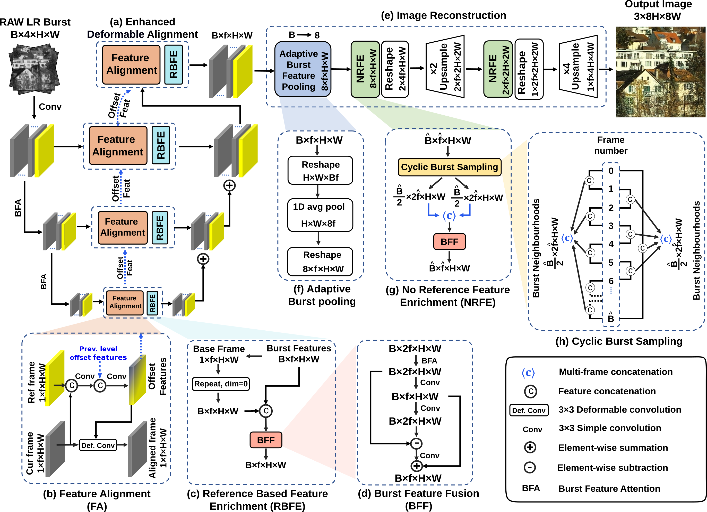

# Burstormer: Burst Image Restoration and Enhancement Transformer (CVPR 2023)

[Akshay Dudhane](https://scholar.google.com/citations?hl=en), [Syed Waqas Zamir](https://scholar.google.es/citations?user=WNGPkVQAAAAJ&hl=en), [Salman Khan](https://salman-h-khan.github.io/), [Fahad Shahbaz Khan](https://scholar.google.es/citations?user=zvaeYnUAAAAJ&hl=en), and [Ming-Hsuan Yang](https://scholar.google.com/citations?user=p9-ohHsAAAAJ&hl=en)

[](https://arxiv.org/pdf/2304.01194.pdf)

#### News
- **Feb 27, 2023:** Paper accepted at CVPR 2023 :tada:

<hr />

> **Abstract:** *On a shutter press, modern handheld cameras capture multiple images in rapid succession and merge them to generate a single image. However, individual frames in a burst are misaligned due to inevitable motions and contain multiple degradations. The challenge is to properly align the
successive image shots and merge their complimentary information to achieve high-quality outputs. Towards this direction, we propose Burstormer: a novel
transformer-based architecture for burst image restoration and enhancement. In comparison to existing works, our approach exploits multi-scale local and non-local features to achieve improved alignment and feature fusion. Our key idea is to enable inter-frame communication in the burst neighborhoods for information aggregation and progressive fusion while modeling the burst-wide context. However, the input burst frames need to be properly aligned before fusing their information. Therefore, we propose an enhanced deformable alignment module for aligning burst features with regards to the reference frame. Unlike existing methods, the proposed alignment module not only aligns burst features but also exchanges feature information and maintains focused communication with the reference frame through the proposed referencebased feature enrichment mechanism, which facilitates handling complex motions. After multi-level alignment and enrichment, we re-emphasize on inter-frame communication within burst using a cyclic burst sampling module. Finally, the inter-frame information is aggregated using the proposed burst feature fusion module followed by progressive upsampling. Our Burstormer outperforms state-ofthe-art methods on burst super-resolution, burst denoising and burst low-light enhancement.*
<hr />

## Network Architecture

 

## Installation

See [install.yml](install.yml) for the installation of dependencies required to run Burstormer.
```
conda env create -f install.yml
```

## Citation
If you use Burstormer, please consider citing:
    
    @article{dudhane2023burstormer,
              title={Burstormer: Burst Image Restoration and Enhancement Transformer},
              author={Dudhane, Akshay and Zamir, Syed Waqas and Khan, Salman and Khan, Fahad Shahbaz and Yang, Ming-Hsuan},
              journal={arXiv preprint arXiv:2304.01194},
              year={2023}
            }
            
Also, check our CVPR-22 paper: Burst Image Restoration and Enhancement

Code is available [here](https://github.com/akshaydudhane16/BIPNet)
    
    @inproceedings{dudhane2022burst,
                    title={Burst image restoration and enhancement},
                    author={Dudhane, Akshay and Zamir, Syed Waqas and Khan, Salman and Khan, Fahad Shahbaz and Yang, Ming-Hsuan},
                    booktitle={Proceedings of the IEEE/CVF Conference on Computer Vision and Pattern Recognition},
                    pages={5759--5768},
                    year={2022}
                  }

## Contact
Should you have any question, please contact akshay.dudhane@mbzuai.ac.ae


**Acknowledgment:** This code is based on the [NTIRE21_BURSTSR](https://github.com/goutamgmb/NTIRE21_BURSTSR) toolbox.
